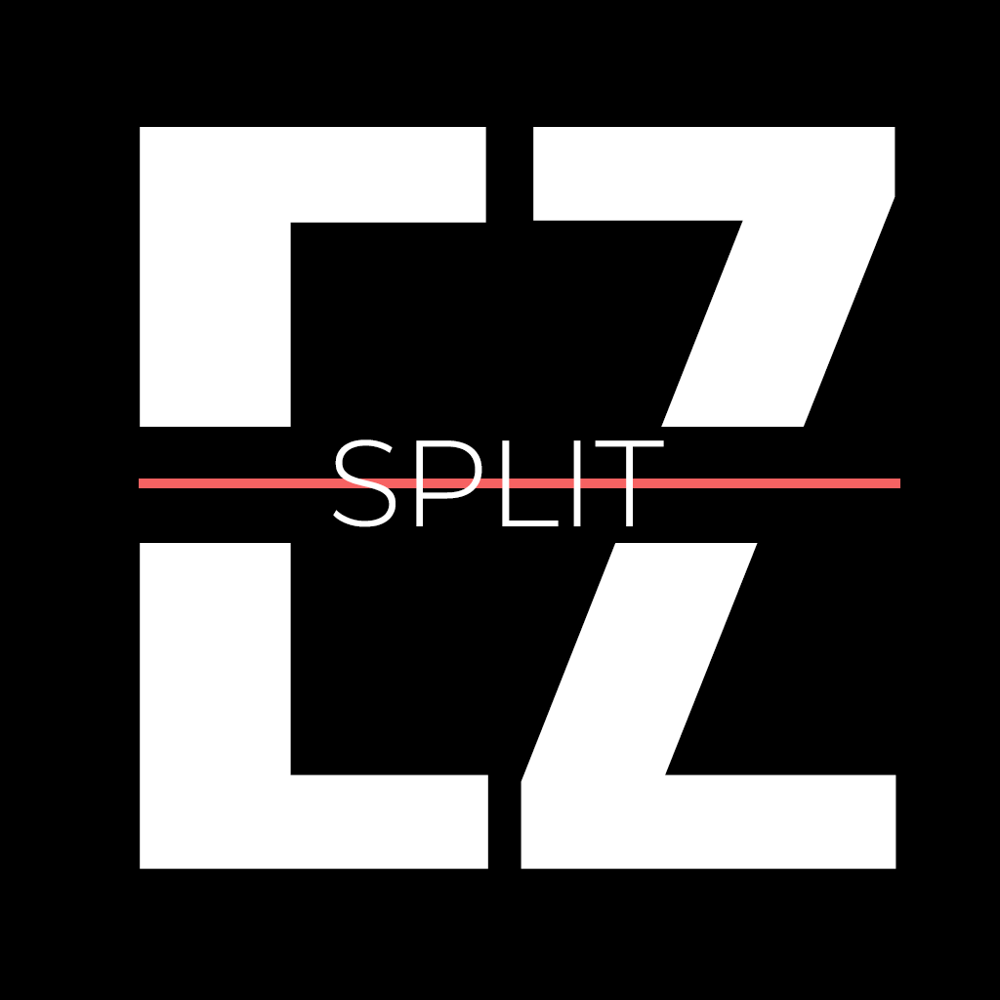
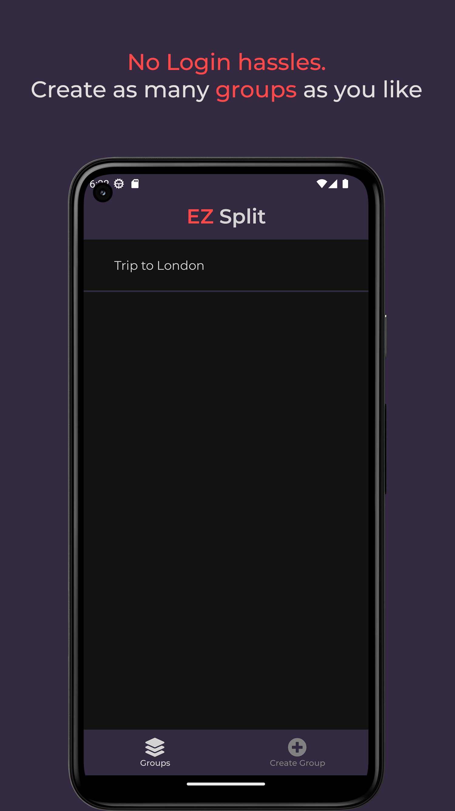
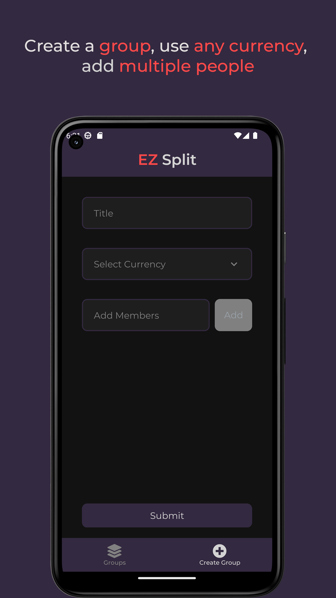
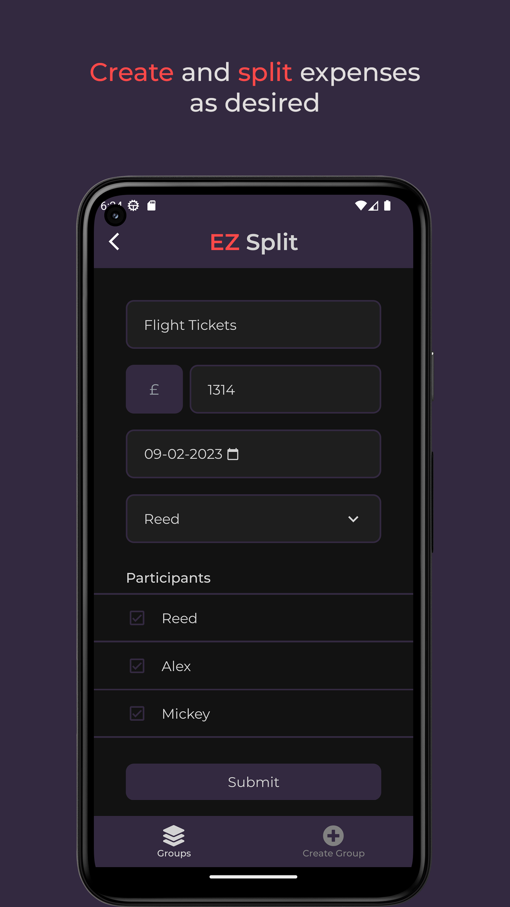
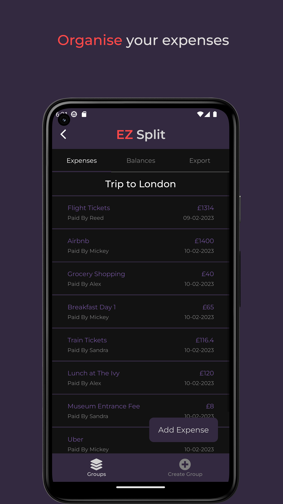
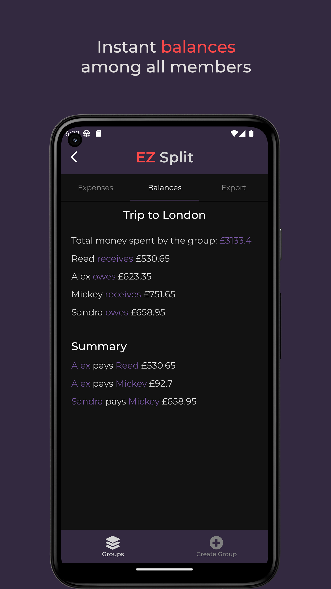
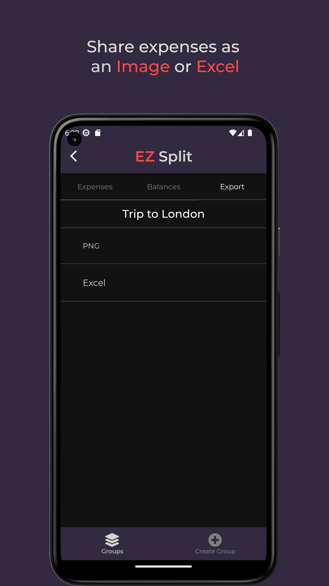

<div align="center">
  
</div>
<br>
<h1 align="center">
  EZ Split - Expenses Made Easy
</h1>

<p align="center">
  <a href="https://docs.expo.dev/get-started/installation/">
    
  </a>
  <a href="https://reactnative.dev/docs/getting-started/">
    
  </a>
  <a href="https://reactnativeelements.com/docs/">
     
  </a>
  <a href="https://play.google.com/store/apps/details?id=com.ibizabroker.EZSplit">
     
  </a>
</p>

<p align="center">
  <a href="#overview">Overview</a>
  •
  <a href="#screenshots">Screenshots</a>
  •
  <a href="#installation">Installation</a>
  •
  <a href="#run-command">Run Command</a>
</p>

# Overview

EZ Split is the ultimate solution for those seeking an effortless and convenient way to split expenses with friends and family. Say goodbye to the hassle of logging in or navigating through complicated sign-up processes. Our app is designed to be quick and straightforward, allowing you to focus on what's most important – splitting expenses.

With our unique feature of exporting an image of all balances in a group, sharing expenses has never been easier. Simply share the image through any messaging or social media platform. For a more detailed report, our app can generate an expense report in the form of an Excel spreadsheet, making it simple to keep track of all your expenses.

EZ Split is super versatile, allowing you to create groups with any currency from across the world. Say goodbye to the frustration of having to manually convert expenses; we've got you covered. Whether you're traveling abroad or splitting expenses with friends from different countries, EZ Split makes it effortless.

Don't wait, download <a href="https://play.google.com/store/apps/details?id=com.ibizabroker.EZSplit">EZ Split</a> today and start splitting expenses in the easiest way possible!

# Screenshots
[Figma Design](https://www.figma.com/file/LGlAFz7qoakgYMqS7qpapc/EZ-Split?node-id=0%3A1&t=eoH04vI3ktDupdcm-1)

||||
|--|--|--|
|  |  | |
|  |  | |

# Installation
The recommended expo-cli version for this app is 6+.
```
npm install
```

# Run Command
To test the dev version of the app:
```
npx expo start
```

To check if the app is working in production, change the [eas.json](./eas.json) configuration to:
```
{
  "build": {
    "preview": {
      "android": {
        "buildType": "apk"
      }
    },
    "preview2": {
      "android": {
        "gradleCommand": ":app:assembleRelease"
      }
    },
    "preview3": {
      "developmentClient": true
    },
    "production": {}
  }
}
```
Create a build file to test the app on emulator:
```
eas build -p android --profile emulatorBuild
```
This will generate an apk file. You can install it on the emulator via command prompt or you can drag and drop the apk file onto the emulator.
